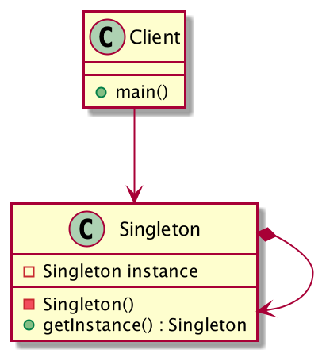

# 介绍

单例类通过在内部创建自己的实例，并提供给外部，保证外部访问的都是同一个对象。外部不需要实例化该类的对象（构造方法私有）

## 特点

* 自己创建自己的实例
* 将这个实例提供给外部
* 只能有一个实例

## 优点

* 减少内存开销，避免频繁创建和销毁实例
* 避免对资源的多重占用

## 缺点

* 与单一职责原则冲突：一个类应该只关心内部逻辑，而不关心外面怎么样来实例化。
* 没有接口，不能继承

## 类图



# 实现

## 饿汉式，线程安全

```java
public class Singleton {
    private static Singleton instance = new Singleton();  
    private Singleton () {}
    public static Singleton getInstance() {  
        return instance;
    }
}
```

依靠类加载机制的保证线程安全

缺点：类加载时进行实例化，可能会造成浪费

## 懒汉式，线程不安全

```java
public class Singleton {  
    private static Singleton instance;  
    private Singleton () {}  
    public static Singleton getInstance() {  
        if (instance == null) {  
            instance = new Singleton();  
        }  
        return instance;  
    }  
}
```

缺点：线程不安全，两个调用方同时进入null判断中，返回不同的对象

## 懒汉式，线程安全

```java
public class Singleton {  
    private static Singleton instance;  
    private Singleton () {}
    //使用synchronized加锁，影响效率
    public static synchronized Singleton getInstance() {  
        if (instance == null) {  
            instance = new Singleton();  
        }  
        return instance;  
    }  
}
```

缺点：每次调用都需要加锁，影响效率

## 双检锁/双重校验锁（DCL），线程安全

```java
public class Singleton {
    //volatile保证每次从内存中读取，跳过cpu缓存
    //正常情况下，线程从内存拷贝变量到cpu缓存，每个线程可能在不同的cpu上，变量的修改是不可见的，可能会造成数据不同步
    private volatile static Singleton singleton;  
    private Singleton () {}
    public static Singleton getSingleton() {  
    	if (singleton == null) {
        	synchronized (Singleton.class) {  
            	if (singleton == null) {  
                	singleton = new Singleton();  
            	}  
        	}  
    	}  
    	return singleton;  
    }  
}
```

DCL（Double-Checked Locking）：线程安全

* volatile：保证可见性（一个线程的修改对另一个线程可见），不能保证原子性，不会使线程阻塞，更轻量的同步机制
* synchronized：保证可见性和原子性

为什么synchronized中还要判一次空？

> 假设两个线程同时进入null，第一个线程创建完对象，第二个线程获得锁还会再创建一遍

只使用volatile，不加synchronized？

> volatile不能保证原子性
>
> 假设两个线程同时进入null，第一个线程创建完对象，第二个线程还会再创建一遍

只使用synchronized，不加volatile？

>使用volatile可以禁止指令重排，`singleton = new Singleton();`可以分为三步：
>
>1. 给对象分配内存空间
>2. 调用构造函数，初始化Singleton对象
>3. singleton变量指向分配的内存空间
>
>发生指令重排之后2、3步骤可能交换，此时另一个线程调用`getInstance`方法，判断不为空直接返回了，但是对象还没完成初始化

## 登记式/静态内部类，线程安全

```java
public class Singleton {  
    private Singleton (){}  
    public static final Singleton getInstance() {  
    	return SingletonHolder.INSTANCE;  
    }
    //通过静态内部类实现懒汉式加载
    //只有显示调用getInstance()时才会加载Holder类
    private static class SingletonHolder {  
    	private static final Singleton INSTANCE = new Singleton();  
    }
}
```

依靠类加载机制的保证线程安全，外部类被加载，内部类不会初始化，只有明确使用到内部类才会初始化。

**补充**

类加载的时机：和虚拟机有关，可能是饿汉式、也可能是懒汉式，并且受JLS保证（当有初始化需求时）

类的初始化，加载完类就进行初始化，可能由以下几种情况触发：

* 使用new关键字实例化对象，或者class.forName()反射
* get和set一个类的静态字段（被final修饰、已在编译期把结果放在常量池的静态字段除外）
* 调用一个类的静态方法

## 枚举

```java
public enum Singleton {  
    INSTANCE;
    public void whateverMethod() {  
    }
}
```

1. 线程安全
2. 调用方无法通过反射创建其他实例。

```java
public T newInstance(Object ... initargs) throws InstantiationException, IllegalAccessException,IllegalArgumentException, InvocationTargetException {
    ...
    //判断是否是枚举，如果是枚举的话，抛出异常
    if ((clazz.getModifiers() & Modifier.ENUM) != 0)
        throw new IllegalArgumentException("Cannot reflectively create enum objects");
    ...
    return inst;
}
```

关于枚举类原理，可以查看[分析Class字节码](/Java/分析Class字节码.md)

# 实例

`InputMethodManager.getInstance()`、`AccessibilityManager.getInstance()`：内部封装了getService

`EventBus.getDefault()`

`ARouter.getInstance()`